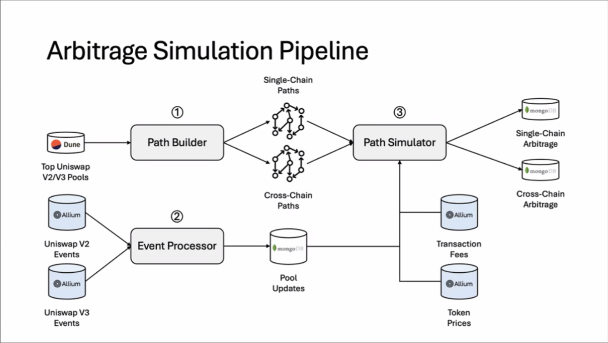

# Cross-chain Arbitrage Dataset

Datasets which analyze arbitrage opportunities across various rollups on Ethereum (Arbitrum, Base, and Optimism). This research examines potential arbitrage paths both within individual chains (single-chain) and across different L2 networks (cross-chain), identifying profitable trading opportunities created by price discrepancies.

The schema of each dataset is included below. The scripts for running the data pipeline outlined in this document are included in the repository.

The dataset is curated by [Christof Torres](https://github.com/christoftorres) and is part of the [TLDR 2025 fellowship program](https://www.thelatestindefi.org/fellowships).

## Single Chain Profitable Paths

**name:** single_chain_profitable_paths.json

**description:** Contains profitable arbitrage paths identified within a single chain

**date_range:** Sample data from November 2024

**size:** 108.9 MB 

**structure:** 

**source:** Path Simulator output from processed Dune and Allium data

**blockchain:** Arbitrum, Base, Optimism

**variables:**

| Variable | Type | Description |
|----------|------|-------------|
| `_id` | OBJECT | MongoDB document identifier |
| `id` | STRING | Unique identifier for the arbitrage opportunity |
| `chain` | STRING | The blockchain network (base, arbitrum, or optimism) |
| `block_number` | INT | Block number where the arbitrage opportunity was identified |
| `timestamp_range_start` | INT | Unix timestamp of the start of the time range |
| `timestamp_range_stop` | INT | Unix timestamp of the end of the time range |
| `number_of_updated_pools` | INT | Count of pools that updated within the time range |
| `number_of_updated_paths` | INT | Count of paths that were affected by pool updates |
| `number_of_paths_with_positive_gains` | INT | Count of paths with theoretical positive returns |
| `number_of_simulated_paths` | INT | Count of paths that were fully simulated |
| `number_of_profitable_non_conflicting_paths` | INT | Count of profitable paths that don't conflict with each other |
| `profitable_non_conflicting_paths` | ARRAY | List of profitable paths that can be executed together |
| `total_profit_usd` | FLOAT | Total potential profit in USD from all profitable non-conflicting paths |

## Cross Chain Profitable Paths

**name:** cross_chain_profitable_paths.json

**description:** Contains profitable arbitrage paths that span multiple L2 networks

**date_range:** Sample data from November 2024

**size:** 156.7 MB

**structure:** 

**source:** Path Simulator output from processed Dune and Allium data

**blockchain:** Arbitrum, Base, Optimism

**variables:**

| Variable | Type | Description |
|----------|------|-------------|
| `_id` | OBJECT | MongoDB document identifier |
| `id` | STRING | Unique identifier for the cross-chain arbitrage opportunity |
| `timestamp_range_start` | INT | Unix timestamp of the start of the time range |
| `timestamp_range_stop` | INT | Unix timestamp of the end of the time range |
| `number_of_updated_pools` | INT | Count of pools that updated within the time range |
| `number_of_updated_paths` | INT | Count of paths that were affected by pool updates |
| `number_of_paths_with_positive_gains` | INT | Count of paths with theoretical positive returns |
| `number_of_simulated_paths` | INT | Count of paths that were fully simulated |
| `number_of_profitable_non_conflicting_paths` | INT | Count of profitable paths that don't conflict with each other |
| `profitable_non_conflicting_paths` | ARRAY | List of profitable paths that can be executed across chains |
| `total_profit_usd` | FLOAT | Total potential profit in USD from all profitable non-conflicting paths |

Within `profitable_non_conflicting_paths`, each path contains:

| Variable | Type | Description |
|----------|------|-------------|
| `path` | ARRAY | Sequential list of swap operations across different chains |
| `profit_usd` | FLOAT | Potential profit in USD from this specific path |
| `amount_usd` | FLOAT | USD value of the initial amount used in the path |

Each item in the `path` array contains:

| Variable | Type | Description |
|----------|------|-------------|
| `chain` | STRING | The blockchain network for this swap |
| `address` | VARCHAR | Contract address of the liquidity pool used |
| `protocol` | STRING | DEX protocol (e.g., uniswap) |
| `version` | STRING | Protocol version (e.g., v2, v3) |
| `token_in_symbol` | STRING | Symbol of the input token |
| `token_out_symbol` | STRING | Symbol of the output token |
| `token_in_address` | VARCHAR | Contract address of the input token |
| `token_out_address` | VARCHAR | Contract address of the output token |
| `token_in_decimals` | STRING | Number of decimals for the input token |
| `token_out_decimals` | STRING | Number of decimals for the output token |
| `fee_tier` | STRING | Fee tier of the pool (for Uniswap V3) |
| `zero_for_one` | BOOLEAN | Direction of the swap in the pool |
| `token_in_amount` | FLOAT | Amount of input token used |
| `token_out_amount` | FLOAT | Amount of output token received |

# Implementation Guideline

An overview of the data pipeline for this paper is shown in the diagram and described below:

A more detailed breakdown of this data pipeline is outlined below. 
1. **Path Builder**:
   - To start, run the Dune query in the Dune frontend. The query can be found in data/dune. This query outputs a CSV file of top Uniswap V2/V3 pools, and should be saved to the working directory as top_pools_over_100m.csv.
   - This csv file will be an input to extract_pools.py, located in the data folder. This script  outputs two json files, pools.json and reserve_token_addresses.json.
   - These two json files are the inputs for the path_builder.py, located in the simulation folder. This script will output two json files as well: cross_chain_paths.json and single_chain_paths.json

2. **Event Processor**:
   - Process Uniswap V2 and V3 events from Allium. The raw SQL queries are saved in the allium folder, and the scripts to pull these events are download_uniswap_v2_events.py and download_uniswap_v3_events.py. These scripts save the data to the data/uniswapv2 or data/uniswapv3 folder, in the folder for each respective network, in files titled {network}_uniswap_{version}_events_2024_11_01.json, where network is either optimism, arbitrum, or base, and version is either v2 or v3.
   - Similarly, pull prices and fees data from Allium using the download_transaction_fees.py and download_token_prices.py scripts, which make Allium calls to save the data in the fees and prices folders respectively, and in network subfolders.
   - Both of the processes in theese sections require a valid Allium key to run. 
   - Store pool updates in a database.

3. **Path Simulator**:
   - Uses inputs from path builder, event processor, transaction fees, and token prices
   - Simulates potential arbitrage paths
   - Outputs profitable single-chain and cross-chain arbitrage opportunities, which is the data that is saved in this authors Google Drive folder on the TLDR data page. 

4. **Detection**:
   - The repository also includes the code for detecting arbitrage opportunities- data examples are included in the Google drive folders, and python scripts are included in the detection folders.
   
